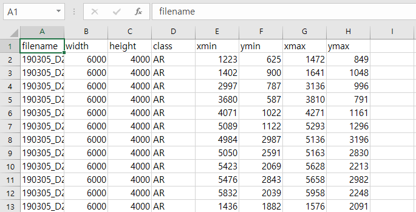
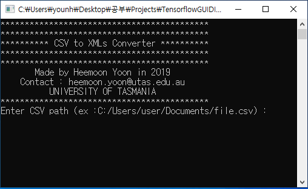
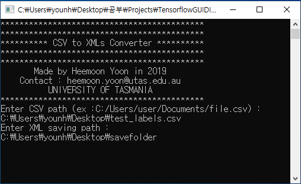
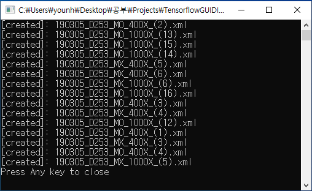

# csv_to_xml
csv to xml converter for Object detection Anotation (Tensorflow). 
[Python version](https://github.com/boguss1225/csv_to_xml/blob/master/csv_to_xml.py) and [Java version](https://github.com/boguss1225/csv_to_xml/blob/master/csv_to_xml/src/csv_to_xml/main.java)

# Description
This program can convert single scv file to multiple xml files.
In the csv file, 'filename,width,height,class,xmin,ymin,xmax,ymax' has to be written in order.

# Screenshots

csv file to be converted

Initial screen of the program

Enter csv path and output path

conversion finished result

